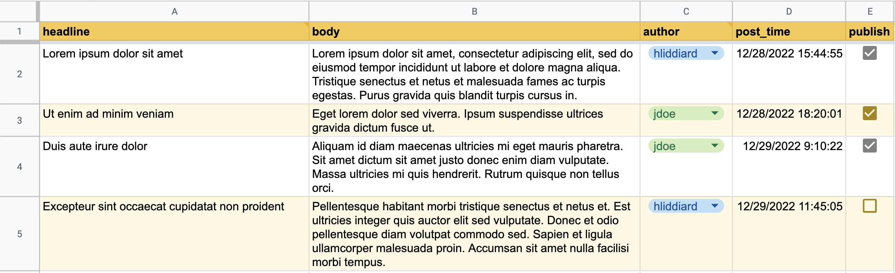

#  google-sheet-s3

A [Google Apps Script](https://developers.google.com/apps-script/) that publishes a Google Sheet to Amazon S3 as a JSON file. Creates an array of objects keyed by column header, maintaining data types like numbers and booleans. 

For example, it turns a spreadsheet like this: 



Into an S3-hosted JSON file like this:

```json
[
  {
    "headline": "Lorem ipsum dolor sit amet",
    "body": "Lorem ipsum dolor sit amet, consectetur adipiscing elit, sed do eiusmod tempor incididunt ut labore et dolore magna aliqua. Tristique senectus et netus et malesuada fames ac turpis egestas. Purus gravida quis blandit turpis cursus in. ",
    "author": "hliddiard",
    "post_time": "2022-12-28T23:44:55.000Z",
    "publish": true
  },
  {
    "headline": "Ut enim ad minim veniam",
    "body": "Eget lorem dolor sed viverra. Ipsum suspendisse ultrices gravida dictum fusce ut.",
    "author": "jdoe",
    "post_time": "2022-12-29T02:20:01.000Z",
    "publish": true
  },
  {
    "headline": "Duis aute irure dolor",
    "body": "Aliquam id diam maecenas ultricies mi eget mauris pharetra. Sit amet dictum sit amet justo donec enim diam vulputate. Massa ultricies mi quis hendrerit. Rutrum quisque non tellus orci.",
    "author": "jdoe",
    "post_time": "2022-12-29T17:10:22.000Z",
    "publish": true
  },
  {
    "headline": "Excepteur sint occaecat cupidatat non proident",
    "body": "Pellentesque habitant morbi tristique senectus et netus et. Est ultricies integer quis auctor elit sed vulputate. Donec et odio pellentesque diam volutpat commodo sed. Sapien et ligula ullamcorper malesuada proin. Accumsan sit amet nulla facilisi morbi tempus.",
    "author": "hliddiard",
    "post_time": "2022-12-29T19:45:05.000Z",
    "publish": false
  }
]
```

Get the add-on [here on the Chrome Web Store](https://chrome.google.com/webstore/detail/publish-sheet-to-s3/dnadifnnmjfmcedgifdienlmloeiongn).

## Why?

### Use case 

"I want to display simple, structured, spreadsheet-like, publicly accessible data on a website (possibly with thousands of simultaneous visitors) that is easily updatable (possibly by multiple people at once) without the overhead and time of coding, deploying, and maintaining a full-blown web application."

### Examples

Staff directory list, restaurant menu items listing, sports team standings page, [live blog](https://github.com/liddiard/react-live-blog/).

## Why not [alternative]?

- Doesn't require OAuth like the [official Google Sheets API](https://developers.google.com/sheets/guides/authorizing) (no good for anonymous data viewing).
- Not using [deprecated APIs](https://developers.google.com/gdata/samples/spreadsheet_sample) like [Tabletop.js](https://github.com/jsoma/tabletop) that could suffer an untimely disappearance at the whims of Google.
- Doesn't require an intermediary web application like [WSJ uses/used](https://gist.github.com/jsvine/3295633).
- Not an alternative service like [Airtable](https://airtable.com) that is powerful but costs 💰💰💰.
- Not slow at returning data like [Google Apps Script Web Apps](http://pipetree.com/qmacro/blog/2013/10/sheetasjson-google-spreadsheet-data-as-json/
) seem to be. (If you're okay with 2000ms response times, this solution is easier because it doesn't involve S3. S3 response times tend to be 10-20x faster.)

## Setup

We need to get an Amazon Web Services (AWS) S3 bucket and your Google Sheet to talk to each other, so there are two parts to this setup: one for AWS, and one for the spreadsheet.

### AWS setup

1. If you don't have one already, [create an Amazon AWS account](https://aws.amazon.com).
2. If you don't have one already, [create an AWS S3 bucket](https://s3.console.aws.amazon.com/s3/).
3. If you don't have one already, [create an IAM user](https://console.aws.amazon.com/iam/home?nc2=h_m_sc#users) that has write permission to your S3 bucket. You'll need these credentials later.
4. Add a **bucket policy** that enables public viewing of the published JSON. To enable, go to your [S3 Management Console](https://s3.console.aws.amazon.com/s3/), click your bucket's name > Permissions tab > Bucket policy > enter your policy (sample to paste below) > click Save.
5. If you're going to be accessing the published JSON data from a web browser, you will also need to add a **CORS policy** to your S3 bucket that allows GET requests from whatever origin (domain name) you want to access your data from. To add a policy, go to your [S3 Management Console](https://s3.console.aws.amazon.com/s3/), click your bucket's name > Permissions tab > CORS configuration > enter your policy (sample to paste below) > click Save.

#### Sample bucket policy

This configuration is what I imagine most people using this add-on will want. It allows **public** access of the data stored in your Google Sheet, but **not** public write access.

Replace the text "PUT-YOUR-BUCKET-NAME-HERE" with your bucket's name.
    
```json
{
    "Version": "2012-10-17",
    "Statement": [
        {
            "Sid": "AddPerm",
            "Effect": "Allow",
            "Principal": "*",
            "Action": "s3:GetObject",
            "Resource": "arn:aws:s3:::PUT-YOUR-BUCKET-NAME-HERE/*"
        }
    ]
}
```
    
#### Sample CORS policy

This configuration will allow any web page on the internet to access your sheet's data. You may not want that. You can modify the line `<AllowedOrigin>*</AllowedOrigin>` and replace the asterisk with your own hostname; e.g. the domain name from which you will be making Ajax requests for the sheet's JSON.

```xml
<?xml version="1.0" encoding="UTF-8"?>
<CORSConfiguration xmlns="http://s3.amazonaws.com/doc/2006-03-01/">
<CORSRule>
    <AllowedOrigin>*</AllowedOrigin>
    <AllowedMethod>GET</AllowedMethod>
    <MaxAgeSeconds>3000</MaxAgeSeconds>
    <AllowedHeader>Authorization</AllowedHeader>
</CORSRule>
</CORSConfiguration>
```

### Google Sheet setup

How to use the add-on **after** completing the above AWS setup.

1. Create or open an existing Google Sheet.
2. Format the sheet so that the first row contains the column headers you want your JSON objects to have as properties. Example: 
3. Install and enable [the add-on](https://chrome.google.com/webstore/detail/publish-sheet-to-s3/dnadifnnmjfmcedgifdienlmloeiongn).
4. In the spreadsheet's menu, go to Add-ons > Publish to S3 > Configure...
5. Fill in the S3 bucket name, folder path within the bucket where you want data stored (leave blank for top level), and your AWS credentials that allow write access to the bucket.
6. Click "Save". The S3 URL of your JSON-ified spreadsheet will be shown.

**Did I miss something in these instructions? Not working as expected? Feel free to [file an issue](https://github.com/liddiard/google-sheet-s3/issues).**

Any time you want to update the published JSON, go to menu item Add-ons > Publish to S3 > Publish.

## Usage notes

- The JSON file's filename is taken from the spreadsheet ID, so the spreadsheet can be safely renamed without breaking the URL.
- The add-on only looks at the sequentially first sheet tab (called "Sheet1" by default). It won't publish or respond to changes on other tabs.
- The add-on will ignore columns that don't have a value in the header (row 1) of the spreadsheet.
- The add-on will ignore empty rows, skipping over them to the next row with values.
- A blank cell in a row is represented in the JSON as `null`. So if you have a column that could have missing or optional values, be sure to handle the `null` value in your consuming code.

## Development setup instructions

1. Create a new [Google Apps Script](https://script.google.com/home) with files whose names and content matches the ones in this repo (minus this readme).
2. In the menu bar, click Deploy > Test Deployments.
3. On the left sidebar, Select type > Editor Add-on.
4. Under Editor Add-on, press Create new test.
5. Version: Latest code, Config: Installed and enabled, Test document: (select a spreadsheet to use)
6. Press Done.
7. Select the saved test and press Execute.

### Developement links for version published to Chrome Web Store

These links are not publicly accessible – please do not request access. They're only for my personal reference to develop the script. If you'd like to develop on this script yourself, follow the instructions above to set up a development environment.

- [Sheet](https://docs.google.com/spreadsheets/d/19loh8WQudFyClZORX_nNzDvI4iVewVy9v70zdog83Uc/edit#gid=0)
- [Apps Script](https://script.google.com/macros/d/MIjU_ktgghpXlevjc5UKzGX33-3kBXtAK/edit?uiv=2&mid=ACjPJvGUsuxrK89WuB25at1Q6PF5qzf82zlLc8iciAjnZ97ozdHkwB-uJrS6tcVQDGi9Ydwk2LipQn5ut_8zT_iLLcYDq8aDnysmrjWpMo8PSk42JGUu0jLxp6TkSxMn8HGyQIAruhbBQw)

## Credits

### Logo attribution

- Cloud icon from [onlinewebfonts.com](http://www.onlinewebfonts.com)
- Arrow by [Alice Design](https://thenounproject.com/rose-alice-design/) from [Noun Project](https://thenounproject.com/browse/icons/term/arrow/)
- Icon mask generated using [Thomas Finch's iOS 7+ Icon Generator](http://thomasfinch.me/iosicon/)